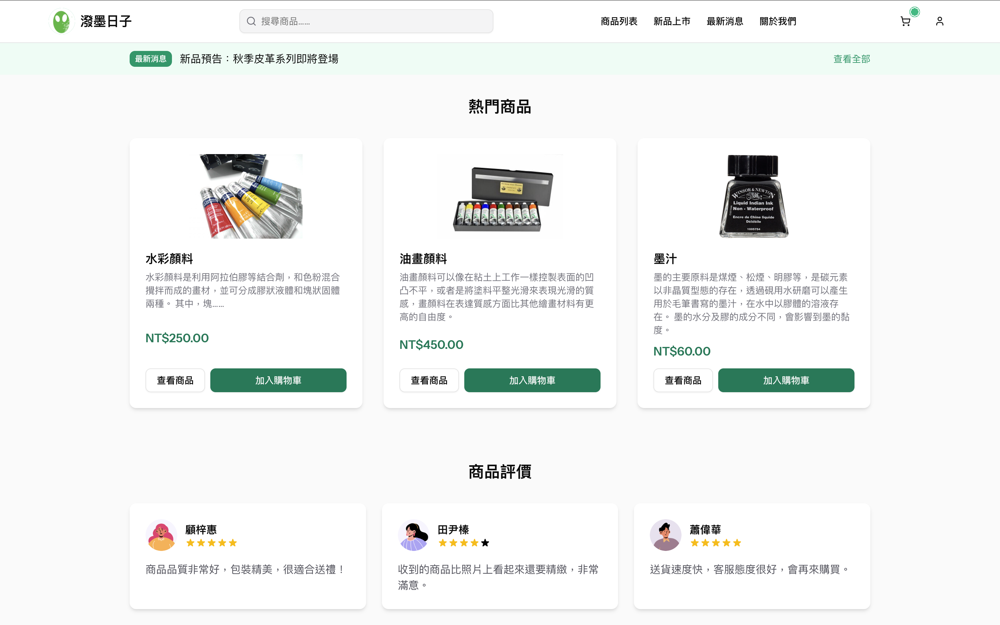
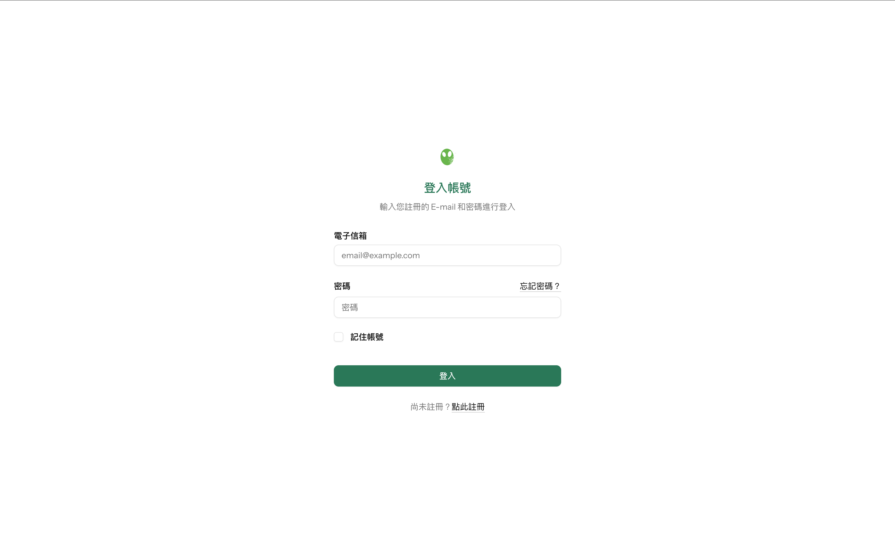
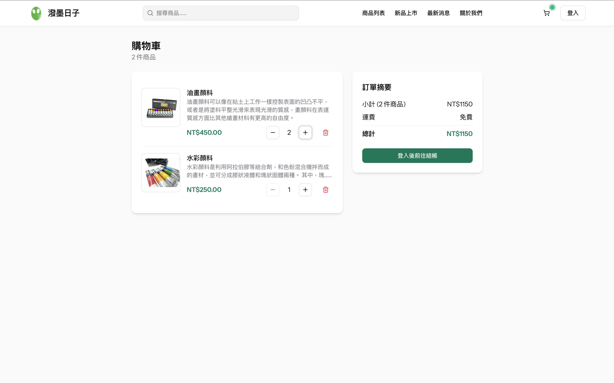
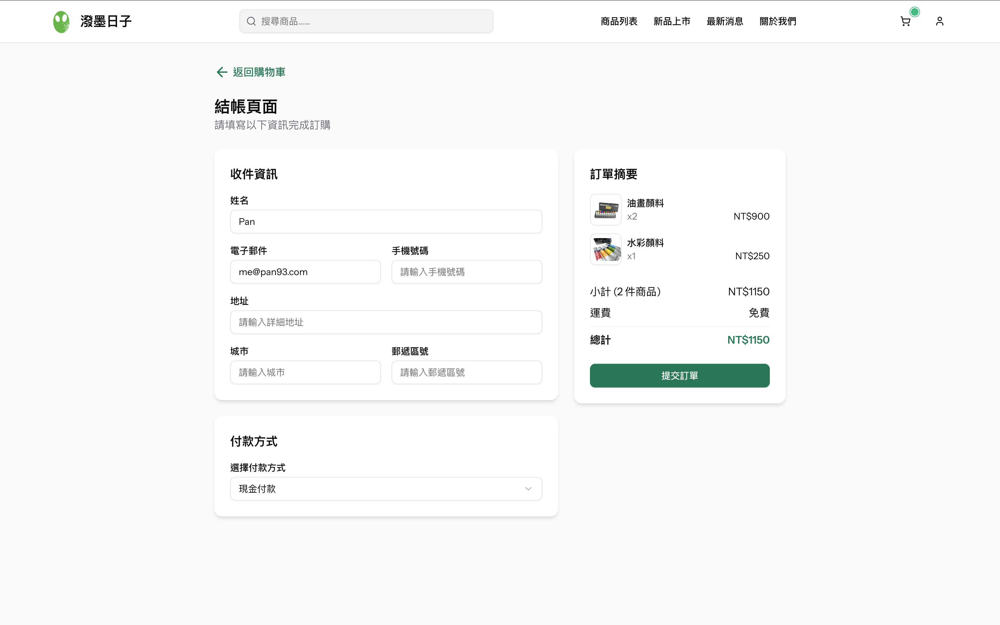
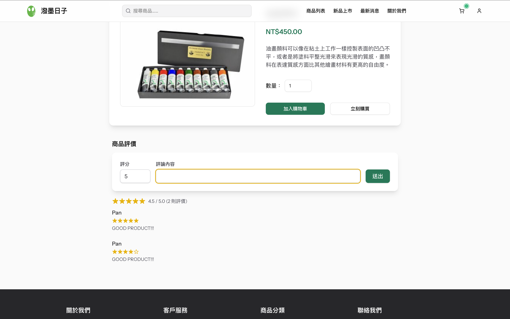
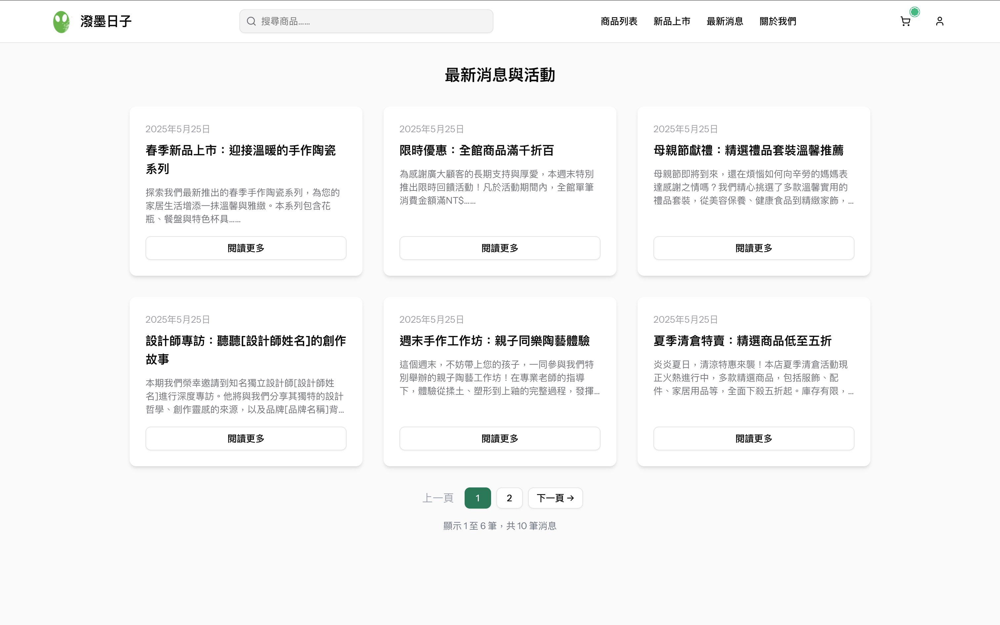
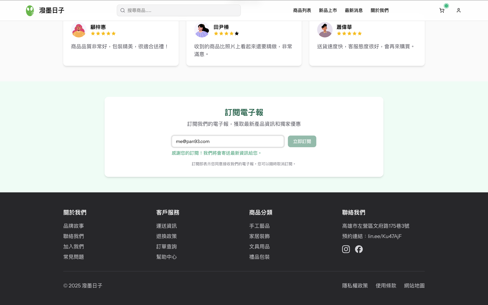
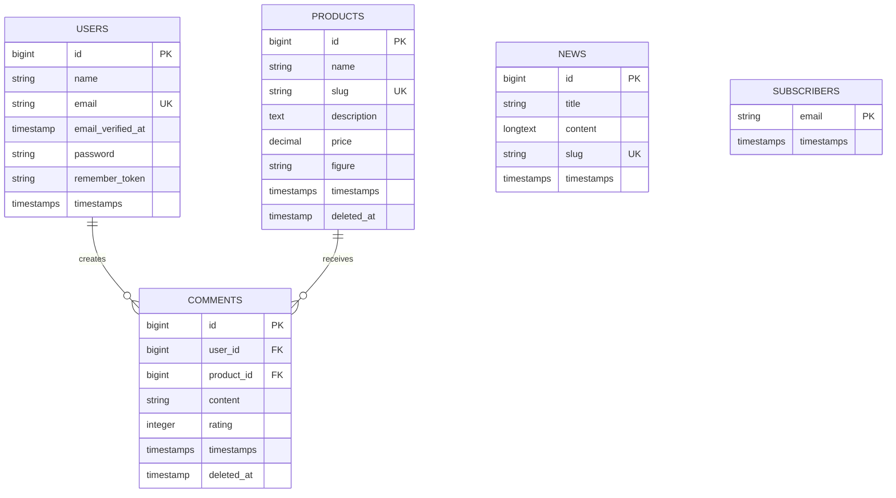

# 「潑墨日子」NKUST 期末專案

「潑墨日子」是一個現代化的電商平台，專門提供精選的禮品商品。使用 Laravel 和 React 打造，提供流暢的購物體驗以及美觀、回應式的介面。

### 主要功能

- **商品目錄**：瀏覽我們精選的禮品系列
  
- **會員帳號**：建立帳號以追蹤訂單與儲存收藏
  
- **購物車**：將商品加入購物車並管理數量
  
- **結帳流程**：安全流暢的結帳流程
  
- **商品評價**：為商品評分並撰寫評論
  
- **最新消息**：掌握最新趨勢與公告
- 
- **電子報訂閱**：訂閱即可收到更新資訊與特別優惠
  

## 技術堆疊

- **後端**：Laravel 12
- **前端**：React 19 搭配 TypeScript
- **UI 框架**：Tailwind CSS
- **狀態管理**：Inertia.js
- **資料庫**：MySQL/PostgreSQL
- **部署**：[Zeabur](https://zeabur.com) 一鍵部署

### 資料庫結構



### 網站端點

#### 首頁端點

| 方法  | 路徑  | 名稱     | 說明 | 需要登入 |
|-----|-----|--------|----|------|
| GET | `/` | `home` | 首頁 | 否    |

#### 商品端點

| 方法   | 路徑                             | 名稱                       | 說明     | 需要登入 |
|------|--------------------------------|--------------------------|--------|------|
| GET  | `/products`                    | `products.index`         | 商品列表   | 否    |
| GET  | `/products/{slug}`             | `products.show`          | 商品詳細   | 否    |
| POST | `/products/{slug}/new-comment` | `products.comment.store` | 新增商品評論 | 是    |

#### 最新消息端點

| 方法  | 路徑             | 名稱           | 說明     | 需要登入 |
|-----|----------------|--------------|--------|------|
| GET | `/news`        | `news.index` | 最新消息列表 | 否    |
| GET | `/news/{slug}` | `news.show`  | 最新消息詳細 | 否    |

#### 購物車端點

| 方法     | 路徑                        | 名稱                | 說明        | 需要登入 |
|--------|---------------------------|-------------------|-----------|------|
| GET    | `/carts`                  | `carts.index`     | 購物車列表     | 否    |
| GET    | `/carts/checkout`         | `carts.checkout`  | 結帳頁面      | 是    |
| POST   | `/carts/{slug}/increment` | `carts.increment` | 增加購物車商品數量 | 否    |
| DELETE | `/carts/{slug}`           | `carts.remove`    | 移除購物車商品   | 否    |
| POST   | `/carts/clear`            | `carts.clear`     | 清空購物車     | 否    |

#### 訂單端點

| 方法  | 路徑                     | 名稱                    | 說明     | 需要登入 |
|-----|------------------------|-----------------------|--------|------|
| GET | `/orders/confirmation` | `orders.confirmation` | 訂單確認頁面 | 是    |
| GET | `/dashboard`           | `dashboard`           | 會員中心   | 是    |

#### 認證端點

| 方法   | 路徑                                 | 名稱                    | 說明       | 需要登入 |
|------|------------------------------------|-----------------------|----------|------|
| GET  | `/register`                        | `register`            | 註冊頁面     | 否    |
| POST | `/register`                        | -                     | 註冊       | 否    |
| GET  | `/login`                           | `login`               | 登入頁面     | 否    |
| POST | `/login`                           | -                     | 登入       | 否    |
| GET  | `/forgot-password`                 | `password.request`    | 忘記密碼頁面   | 否    |
| POST | `/forgot-password`                 | `password.email`      | 發送忘記密碼郵件 | 否    |
| GET  | `/reset-password/{token}`          | `password.reset`      | 重設密碼頁面   | 否    |
| POST | `/reset-password`                  | `password.store`      | 重設密碼     | 否    |
| GET  | `/verify-email`                    | `verification.notice` | 驗證郵件頁面   | 是    |
| GET  | `/verify-email/{id}/{hash}`        | `verification.verify` | 驗證郵件     | 是    |
| POST | `/email/verification-notification` | `verification.send`   | 發送驗證郵件   | 是    |
| GET  | `/confirm-password`                | `password.confirm`    | 確認密碼頁面   | 是    |
| POST | `/confirm-password`                | -                     | 確認密碼     | 是    |
| POST | `/logout`                          | `logout`              | 登出       | 是    |

## 開發

### 前置需求

- PHP 8.2+
- Composer
- Node.js (v18+)
- npm 或 pnpm

### 設定

1. 複製儲存庫：

   ```
   git clone https://github.com/yourusername/daywithyou-webapp.git
   cd daywithyou-webapp
   ```

2. 複製環境設定檔：
   ```
   cp .env.example .env
   ```

3. 啟動 [Laravel Sail](https://laravel.com/docs/sail)：
   ```
   ./vendor/bin/sail up -d
   ```

4. 安裝 JavaScript 依賴套件：
   ```
   ./vendor/bin/sail pnpm install
   ```

5. 產生應用程式金鑰：
   ```
   ./vendor/bin/sail artisan key:generate
   ```

6. 執行資料庫遷移：
   ```
   ./vendor/bin/sail artisan migrate
   ./vendor/bin/sail artisan db:seed DatabaseSeeder
   ./vendor/bin/sail artisan db:seed ProductSeeder
   ./vendor/bin/sail artisan db:seed NewsSeeder
   ```

7. 啟動 Vite 開發伺服器：
   ```
   ./vendor/bin/sail pnpm dev
   ```

8. 在瀏覽器中開啟 `http://localhost`。

### 測試

執行測試套件：

```
./vendor/bin/sail artisan test
```

## 部署

### Zeabur 一鍵部署

1. 部署好 MySQL、Redis 服務
2. 使用 GitHub 儲存庫部署這個專案，並將 `.env.zeabur` 的內容貼上「環境變數」。
   注意您需要先自行產生 `APP_KEY`。
3. 待服務啟動完成後，執行 seeding：
   ```
   php artisan db:seed DatabaseSeeder
   php artisan db:seed ProductSeeder
   php artisan db:seed NewsSeeder
   ```
4. 將 `APP_ENV` 切回 `production` 後重新啟動服務即可。

## 貢獻

歡迎貢獻！請隨時提交 Pull Request。

## 授權

本專案採用 Apache 2.0 授權 - 詳細資訊請參閱 LICENSE 檔案。
